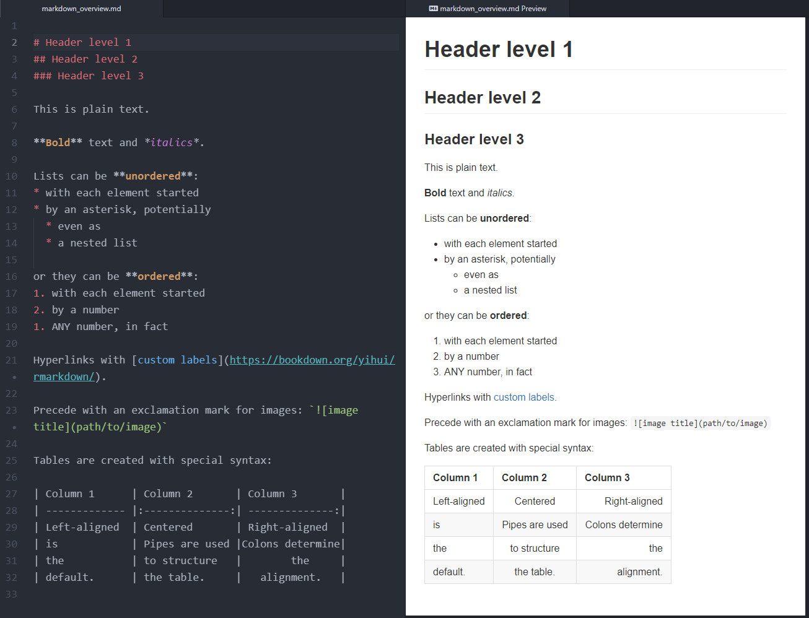

```{r setup, include=FALSE}
knitr::opts_chunk$set(
  echo = FALSE,
  message = FALSE,
  warning = FALSE,
  collapse = TRUE,
  cache = FALSE,
  comment = "#>"
)

library(readr)
library(dplyr)
library(ggplot2)
library(gapminder)
library(kableExtra)

year_of_interest <- 2007
```


# Introduction

The key motivation for learning and using **R Markdown** is to avoid repetitive and error-prone tasks. More specifically, you should use R Markdown if you want to:

* concentrate on content rather than formatting
* share one document in many different formats (Markdown, PDF, Word, HTML)
* ensure correct citations and bibliographies
* switch between different citation formats
* integrate your data analysis automatically, not statically

This course module can only scratch the surface of the available features in *R Markdown* and aims to introduce a few key concepts and simple recipes. Consult the standard reference, *R Markdown: The Definitive Guide* [@XieAllaire_et_2022], to learn more. A useful resource for daily work with R Markdown is also the 'R Studio Cheatsheet' [Dynamic documents with rmarkdown](https://raw.githubusercontent.com/rstudio/cheatsheets/main/rmarkdown.pdf).

This document is a simple summary of the course module. Most importantly however it is created using R Markdown and is thus a self-documenting example. The source for this document can be found in this Github repository: <https://github.com/sdaume/r-course-module-3>


# Basic Markdown

*Markdown* is a type of *Markup* language; HTML is a well-known example for markup. In contrast to the latter *Markdown* is a light-weight and easily readable type of markup. If you have ever edited a Wikipedia page, you have come across one type of lightweight markup. Markdown is even easier. 

The following Figure \@ref(fig:markdown-editor) shows some common Markdown syntax and how this is interpreted (or rendered) in for example an HTML page. The figure is a screenshot of the [Atom](https://atom.io/) text editor which supports Markdown syntax and offers a preview of the interpreted Markdown. 

```{r markdown-editor, echo=FALSE, fig.cap="This is a screenshot of the Atom text editor showing some basic Markdown syntax and how it would be rendered."}


```

A look at the table syntax shows however that even Markdown could get complicated to edit. Most importantly, we might want our table content to be dynamically generated. This is where `R Markdown` shines and will help.

While a Markdown file is human-readable, it is almost always intended to be rendered into a suitable output format, commonly HTML, PDF or Word. This is even more true when working with the `R Markdown` variant. Hence, a typical workflow working with Markdown documents is: 

1. **write** content as a Markdown document, 
2. **generate** the final document in a suitable output format (commonly HTML, PDF, Word)
3. **publish** 


# R Markdown

The R flavour of Markdown --- **R Markdown** --- enables us to dynamically 'weave' together text, data and analysis workflows. The primary work-horse^[Some other tools like `pandoc` and `TinyTeX` also help behind the scenes.] enabling this is the [`knitr`](https://yihui.org/knitr/) package [@knitr_package], which is conveniently integrated into the R Studio UI. You will find a "Knit" button at the top of the editor when opening an R Markdown file in R Studio, which will **generate** the output document (as per the workflow above).

R Markdown files use the file extension **`.Rmd`** and must start with a so-called **YAML header** section. The YAML header contains meta-data that primarily controls the target output document created from a Markdown document. The **YAML header** must be placed at the beginning of a document and is enclosed by three dashes `---`.
 
Below is a simple YAML header created by default when creating a new `R Markdown` file in R Studio (i.e. *File > New File > R Markdown...*).


````{verbatim}
---
title: "Untitled"
output: html_document
date: '2022-06-16'
---
````

The **YAML header** contains meta-data (e.g. title, date, author(s) etc) as well as information about the output format and style. The YAML header of the current  document looks like this:

````{verbatim}
---
title: "R Markdown: Key Takeaways"
subtitle: "SRC R Course, Module 3"
author: "Stefan Daume"
date: '2022-06-16'
output:
  bookdown::html_document2:
    theme: flatly
    toc: yes
    number_sections: true
bibliography: references.bib
link-citations: yes
csl: ecology-and-society.csl
---
````

It also specifies HTML as the output format, but uses a variant,  `bookdown::html_document2` instead of the default `rmarkdown::html_document`, which offers more versatility. It also specifies a styling theme for the output HTML document, forces creation of a table of contents and causes sections to be numbered. Consult the [YAML chapter](https://bookdown.org/yihui/rmarkdown-cookbook/rmarkdown-anatomy.html) in the 'R Markdown cookbook'  [@XieAllaire_et_2022] for more information.


## Dynamic content

The primary purpose of R Markdown is to create data-driven documents, i.e. to integrate your analysis as reproducible R code and generate the results dynamically when `kniting` the document.

Text and code are **interspersed** and code sections are included in **code chunks** like this. 


```{embed, file = "plain-code-chunk-sample.Rmd", echo=TRUE}
```


### Dynamic plots

Below is a Gapminder [@gapminder_package] example adapted from the previous course sessions. 


```{embed, file = "life-expectancy-code-sample.Rmd", echo=TRUE}
```


It generated the following plot when the current R Markdown document was `knit`.

```{r life-expectancy, echo=FALSE}
library(gapminder)

gapminder %>% 
    group_by(year) %>%
    summarise(ale = mean(lifeExp)) %>%
    ggplot(aes(x = year, y = ale)) +
    geom_line(color = "orange") +
    labs(x = "Year", 
         y = "Average life expectancy") +
    theme_classic(base_size = 16)
```


### Dynamic tables

The same works for tables. We can use the `kable()` function in the `knitr` package to create a table. Below is again some code summarizing Gapminder data. 

```{embed, file = "gapminder-code-sample.Rmd", echo=TRUE}
```

The single line at the end creates the following table in this document: 

```{r echo=FALSE}
# summarize gapminder data by continent
gapminder_latest <- gapminder %>% 
  filter(year == year_of_interest) %>%
  group_by(continent) %>%
  summarise(avrg_le = mean(lifeExp),
            avrg_gdp = mean(gdpPercap))
              
# print the results as a table
gapminder_latest %>%
  knitr::kable()
```


Tables can be customized particularly well with the [`kableExtra`](https://haozhu233.github.io/kableExtra/awesome_table_in_html.html) package [@kableExtra_package], which wraps and extends the basic `kable` functionality.

We can for example customize the previous simple table with dynamic colouring based on the table cell values, add a caption etc. 

```{r, echo=FALSE}
gapminder_latest <- gapminder::gapminder %>% 
  filter(year == year_of_interest) %>%
  group_by(continent) %>%
  summarise(avrg_le = mean(lifeExp),
            avrg_gdp = mean(gdpPercap))
            
gapminder_latest %>%
  kbl(digits = c(0,1,2),
      caption = paste("Table caption: Dynamic formatting with the the help of `kableExtra`. This example shows Gapminder data summarised by continent for the year ", year_of_interest, ".", sep = ""),
      col.names = c("Continent", "Mean life expectancy", "Mean GDP")) %>%
  kable_paper(full_width = F) %>%
  column_spec(2, color = "white",
                 background = spec_color(gapminder_latest$avrg_le[1:5])) %>%
  column_spec(3, color = "white",
                 background = spec_color(gapminder_latest$avrg_gdp[1:5]))
```


## Citations and bibliographies

Support for managing citations and bibliographies is one of the most useful and powerful features for researchers using R Markdown. In order to cite references dynamically in an R Markdown document, a **BibTeX** database is required and it has to be referenced in the YAML header of the R Markdown document which should include the citations. The example YAML header shown above included the line `bibliography: references.bib` which accomplishes this.

A "**BibTeX** database" is thus simply a text file with the extension **`.bib`** and entries such as those:

```
@misc{XieAllaire_et_2022,
  author = {Xie, Yihui and Allaire, J. J. and Grolemund, Garrett},
  title = {{R Markdown: The Definitive Guide}},
  url = {https://bookdown.org/yihui/rmarkdown/},
  urldate = {2022-06-07},
  year = {2022}
}
```

There is no need to compile those manually. BibTeX databases can be export from your reference manager of choice or for individual articles often directly from journal pages. 

Citations are then directly included in the text of an R Markdown file in the form of the following: **`[@CitationKey]`**. Thus to cite the example shown above we include **`[@XieAllaire_et_2022]`**, which is a then rendered to: [@XieAllaire_et_2022].

All references cited in a document are assembled into a bibliography, which is by default added to the end of the document. Simply add the header **`# References`** at the end of your document, **`knit`** and the complete bibliography is appended  to the output document.

### Citation styles

With one simple line in the YAML header we can also change how the citation and bibliography is styled. Should references be of type author/year, one or multiple authors, numeric? Should bibliographies be ordered alphabetically, in order of citations? 

The **[Citation Style Database](https://www.zotero.org/styles)** database contains thousands of [citation styles](https://citationstyles.org/) required by different journals and specifies them in `.csl` files. 

Download the relevant one for your required style, reference the CSL file in the YAML header (i.e. add `csl: YOUR_TARGET_JOURNAL.csl`) and the output document should be rendered with the required citation and bibliography style. 


# Useful resources

* [R Markdown: The Definitive Guide](https://bookdown.org/yihui/rmarkdown/) [@XieAllaire_et_2022]
* [Cheatsheet: Dynamic documents with rmarkdown cheatsheet](https://raw.githubusercontent.com/rstudio/cheatsheets/main/rmarkdown.pdf)
* [Awesome tables in HTML with `kableExtra`](https://haozhu233.github.io/kableExtra/awesome_table_in_html.html)
* [Citation Styles](https://citationstyles.org/) and the [Citation Style Database](https://www.zotero.org/styles) 


# References
