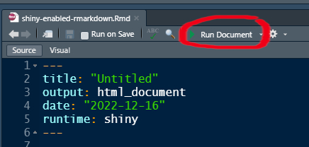
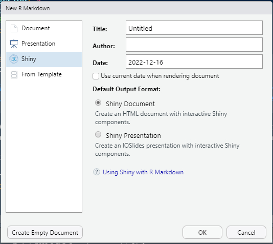

---
output:
  md_document:
    variant: markdown
always_allow_html: true
---

```{r setup, include=FALSE}
# pandoc cmd snippet:
# pandoc -t revealjs --template=./slides/custom_pandoc_template/default.revealjs -s -o ./slides/shiny-module.html ./slides/shiny-module.md ./slides/shiny-module_metadata.yaml -V revealjs-url=./reveal.js-3.6.0 --mathjax --no-highlight -V highlighting-css=zenburn -V controlsLayout=edges --bibliography ./slides/references.bib

# create pdf
# decktape -s 1920x1080 reveal ./slides/shiny-module.html ./slides/2022-R-Course-Module-7.pdf

# create screenshots
# decktape reveal ./slides/shiny-module.html ./slides/2022-R-Course-Module-7.pdf --screenshots --screenshots-directory ./slides/handouts/screenshots

knitr::opts_chunk$set(
  echo = TRUE,
  message = FALSE,
  warning = FALSE,
  collapse = TRUE,
  cache = FALSE,
  comment = "#>")
```

[//]: <> (Alternative background colours are #002b36 #333 #1E8C45)


## &nbsp; {.hideslideheader data-background="#061C30"}
<div style="display:table;width:100%;table-layout: fixed;">
  <div class="title-without-logo" style="display:table-cell;width:100%;padding-right:3%;padding-left:3%;vertical-align:middle;">
  SRC PhD R course Module 7
  
  Interactive R Markdown with Shiny
    
  &nbsp;
    
  &nbsp;
  
  &nbsp;
  
  &nbsp;
  </div>
</div>

<div style="display:table;width:100%;table-layout: fixed;">
  <div class="mytitlepage linksection" style="display:table-cell;width:30%;padding-left:3%;vertical-align:bottom;">
  *[\@stefandaume](https://twitter.com/stefandaume)* 

  *https://scitingly.net/*
  
  *stefan.daume@su.se*
  </div>
  
  
  <div class="mytitlepage authorsection" style="display:table-cell;width:70%;padding-right:3%;">
  &nbsp;
  **Stefan Daume**
  
  *[Stockholm Resilience Centre, Stockholm University](https://www.stockholmresilience.org/meet-our-team/staff/2021-01-27-daume.html)* 
  
  & *[Beijer Institute of Ecological Economics](https://beijer.kva.se/programmes/complexity/)*

  &nbsp;

  *16. December 2022*
  </div>
</div>


## Why interactive web-based R applications?

* communication of research
* data collection
* exploratory analysis
* collaboration


## "shiny"

* Allows to create interactive web applications running R.

* Requires three components: 
  1. an HTML user interface, 
  2. a server component (running R logic), 
  3. a wrapper to launch the application
* In order to run this a web server is required, a basic server is built into R/RStudio 
* or apps can be deployed to hosted R Servers like [shinyapps.io](https://shinyapps.io)


## Basic structure

```
library(shiny)

ui <- fluidPage(
  # defines layout and web page components
)

server <- function(input, output) {
  # defines the R logic and maps web page 
  # inputs to rendered outputs
}

shinyApp(ui = ui, server = server)
```


## Example

```
library(shiny)

ui <- fluidPage(
  selectInput(inputId = "selectedDataset", label = "Dataset",
              choices = ls("package:datasets")),

  tableOutput(outputId = "myTable")
)

server <- function(input, output) {
    output$myTable <- renderTable({
      dataset <- get(input$selectedDataset, "package:datasets")
      dataset
    })
}

shinyApp(ui = ui, server = server)
```

Test it here: https://scitingly.shinyapps.io/datasets/


## Building from scratch ...

* ... gives complete flexibility
* ... but also requires "building from scratch"


## Alternative

If you are already using RMarkdown for writing your papers or to document your analyses, then it is easy to turn these documents into interactive web applications.


## Today's focus: Shiny-enabled RMarkdown

>* specifically: [`flexdashboard`s](https://pkgs.rstudio.com/flexdashboard/index.html)
>* at basic level this is just a custom (non-dynamic) HTML output of R analyses
>* but it can be made interactive with `shiny` and deployed as a web application
>* easily enabled with one line in the YAML header


# Recap: (R)Markdown

## Markdown

**Markdown** allows us to concentrate on document structure and content. We can then worry about styling and presentation later.


## RMarkdown

* Purpose: dynamically weave together text, data and analysis workflows.
* This is accomplished with the [`knitr`](https://yihui.org/knitr/) package, an R package conveniently integrated into the R Studio UI.


## Sample Markdown

<div style="display:table;width:100%;table-layout:fixed;">
  <div style="display:table-cell;width:50%;padding-left:1%;vertical-align:top;">
  
  **Basic (R)Markdown**
  
```
# Top-level header

## Second-level header

This is a list:

* with some **bold** and 
* some *italic* text.

And a [hyperlink](https://bookdown.org/yihui/rmarkdown/) for good measure.
```

  </div>
  
  
  <div style="display:table-cell;width:50%;padding-right:1%;text-align:left;vertical-align:top;">
  
Typical workflow with markdown: 

1. **write** content as a Markdown document, 
2. **generate** the final document in a suitable output format (commonly HTML, PDF, Word)
3. **publish** 
    
  </div>
</div>


## Basic formatting and structuring

```{r echo=FALSE}
knitr::include_graphics('./images/markdown_basic.jpg')
```


## RMarkdown: data-driven documents!

* Analysis can be integrated as **R code** into the document
* The analysis (i.e. the R code) is executed and the results updated when you **`knit`** the document.
* Text and code are **interspersed**.
* Code sections are included in **code chunks** like this. 

<verbatim>

```{r some-explanatory-label, echo=FALSE}
# here goes your R code
```

</verbatim>

<aside class="notes">
* contains an **optional** label (can be used for references), options controlling the output, such as figure size, caption, resolution 
</aside>


## The 'YAML' header

The **YAML header** must be placed at the beginning of a document and is enclosed by three dashes `---`.

````{verbatim}
---
title: "Untitled"
output: html_document
date: '2022-12-16'
---
````

Above is the default *YAML header* when generating an `RMarkdown` file in R Studio.

<aside class="notes">
* see RMarkdown book for details
* The **YAML header** contains meta-data (e.g. title, date, author(s) etc) as well as information about the output format and style.
* show the YAML header and explain; output format (default HTML, others are possible)
</aside>


## Translating RMarkdown to HTML, PDF, Word etc 

<div style="display:table;width:100%;table-layout:fixed;">
  <div style="display:table-cell;width:50%;padding-left:1%;text-align:left;vertical-align:middle;">
  
The RMarkdown document is **knit** to the output format specified in the YAML header.

  </div>
  
  
  <div style="display:table-cell;width:50%;padding-right:1%;vertical-align:middle;">
  
```{r echo=FALSE}
knitr::include_graphics('./images/rstudio_knit.jpg')
```
    
  </div>
</div>


## Turning RMarkdown into a shiny app

````{verbatim}
---
title: "Untitled"
output: html_document
date: '2022-12-16'
runtime: shiny
---
````


## Now "knit" is replaced by "run"

<div style="display:table;width:100%;table-layout:fixed;">
  <div style="display:table-cell;width:50%;padding-left:1%;text-align:left;vertical-align:middle;">
The **output format** is now a web application.
  </div>
  
  <div style="display:table-cell;width:50%;padding-right:1%;vertical-align:middle;">
  
```{r echo=FALSE}

```
    
  </div>
</div>


## And you need the "app logic"

Which will be included in the **code chunks** of the R Markdown document.


# Example and Exercise

## Create a sample interactive R Markdown document

In RStudio select: `File > New File > R Markdown`

```{r echo=FALSE, out.width="40%"}

```

Default [example](https://github.com/sdaume/r-course-module-3/blob/main/shiny_examples/markdown/basic-shiny-rmarkdown.Rmd)


## Interactive code in the default example

````{verbatim}
```{r eruptions, echo=FALSE}
inputPanel(
  selectInput("n_breaks", label = "Number of bins:",
              choices = c(10, 20, 35, 50), selected = 20),
  
  sliderInput("bw_adjust", label = "Bandwidth adjustment:",
              min = 0.2, max = 2, value = 1, step = 0.2)
)

renderPlot({
  hist(faithful$eruptions, probability = TRUE, breaks = as.numeric(input$n_breaks),
       xlab = "Duration (minutes)", main = "Geyser eruption duration")
  
  dens <- density(faithful$eruptions, adjust = input$bw_adjust)
  lines(dens, col = "blue")
})
```
````

## Change the output format to flex_dashboard

[Example](https://github.com/sdaume/r-course-module-3/blob/main/shiny_examples/markdown/1-basic-shiny-rmarkdown.Rmd)


## Change the layout

Dashboards are composed of rows and columns. Each output component is indicated by a *level 3* header (i.e. `###`).

* turn all sections into components
* change the `flex_dashboard` layout to [vertical](https://pkgs.rstudio.com/flexdashboard/articles/flexdashboard.html#layout) 

```
---
title: "Untitled"
output: 
  flexdashboard::flex_dashboard:
    vertical_layout: scroll
date: "2022-12-16"
runtime: shiny
---
```

[Example](https://github.com/sdaume/r-course-module-3/blob/main/shiny_examples/markdown/2-basic-shiny-rmarkdown.Rmd)


## Split input and output logic into different "components"

[Example](https://github.com/sdaume/r-course-module-3/blob/main/shiny_examples/markdown/3-basic-shiny-rmarkdown.Rmd)


## Change the component layout

`flexdashboard` allows [flexible layouts](https://pkgs.rstudio.com/flexdashboard/articles/layouts.html) that are basically **controlled through markdown section headers at three levels**.

* create two separate dash board pages by adding a *level 1* markdown section header above the first two and the last "components" respectively. Both the header variant `#` and `===========================` will work.

[Example](https://github.com/sdaume/r-course-module-3/blob/main/shiny_examples/markdown/4-basic-shiny-rmarkdown.Rmd)


## Create a nested layout for the first page

Place the "Inputs" and "Outputs" sections next to each other. This can be achieved by 
adding a *level 2* markdown section header named `Column` above each of these sections. Both the header variant `##` and `-----------------------` will work.

[Example](https://github.com/sdaume/r-course-module-3/blob/main/shiny_examples/markdown/5-basic-shiny-rmarkdown.Rmd)


## Change the dashboard theme and add 

`flexdashboard` offers flexible styling of the output. Several built-in  [themes](https://pkgs.rstudio.com/flexdashboard/articles/theme.html) can be applied via the YAML header.

[Example](https://github.com/sdaume/r-course-module-3/blob/main/shiny_examples/markdown/6-basic-shiny-rmarkdown.Rmd)


## and more options ...

There is a broad range of styling options and components that can be controlled via the YAML header and standard R Markdown elements.

[Example](https://github.com/sdaume/r-course-module-3/blob/main/shiny_examples/markdown/7-basic-shiny-rmarkdown.Rmd)


# Thank You!


## Key Resources

* R Markdown
  * [R Markdown: The Definitive Guide](https://bookdown.org/yihui/rmarkdown/) [@XieAllaire_et_2022]
  * [Cheatsheet: Dynamic documents with rmarkdown cheatsheet](https://raw.githubusercontent.com/rstudio/cheatsheets/main/rmarkdown.pdf)
* Git/Github:
  * [Happy Git and GitHub for the useR](https://happygitwithr.com/) [@Bryan2021]
  * "Excuse me, do you have a moment to talk about version control?" [@Bryan2017]
  * Advanced git use: [Pro Git](https://git-scm.com/book/en/v2) book [@Chacon_et_2014_Book]
  * [How to write a great commit message](https://cbea.ms/git-commit/)


## References

<div id="refs"></div>


## Colophon {.colophon}
**SRC PhD R course Module 7 --- Interactive R Markdown with Shiny"** by *Stefan Daume*

&nbsp;

Presented on 16. December 2022.

&nbsp;

This presentation can be cited using: *doi:...*

&nbsp;

**PRESENTATION DETAILS**

**Author/Affiliation:** Stefan Daume, Stockholm Resilience Centre, Stockholm University

**Presentation URL:** https://sdaume.github.io/r-course-module-3/slides/shiny-module.html

**Presentation Source:** [TBD]

**Presentation PDF:** [TBD]

&nbsp;

**CREDITS & LICENSES**

This presentation is delivered with the help of several free and open source tools and libraries. It utilises the [reveal.js](https://revealjs.com/) presentation framework and has been created using [RMarkdown](https://rmarkdown.rstudio.com), [knitr](https://yihui.name/knitr/), [RStudio](https://www.rstudio.com) and [Pandoc](https://pandoc.org/). [highlight.js](https://highlightjs.org) provides syntax highlighting for code sections. [MathJax](https://www.mathjax.org) supports the rendering of mathematical notations. PDF and JPG copies of this presentation were generated with [DeckTape](https://github.com/astefanutti/decktape). Please note the respective licenses of these tools and libraries.


&nbsp;

If not noted and attributed otherwise, the contents (text, charts, images) of this presentation are **Copyright &copy; 2022 of the Author** and provided under a *CC BY 4.0* public domain license. 
