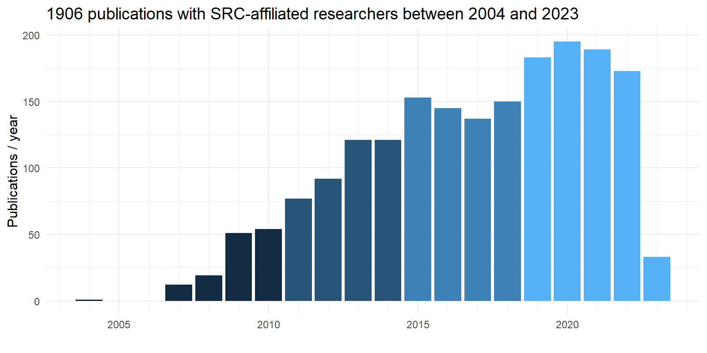

##   {#section .hideslideheader data-background="#061C30"}

::: {style="display:table;width:100%;table-layout: fixed;"}
::: {.title-without-logo style="display:table-cell;width:100%;padding-right:3%;padding-left:3%;vertical-align:middle;"}
SRC PhD R course Module 9

Topic modelling

 

 

 

 
:::
:::

::: {style="display:table;width:100%;table-layout: fixed;"}
::: {.mytitlepage .linksection style="display:table-cell;width:30%;padding-left:3%;vertical-align:bottom;"}
*[\@stefandaume](https://twitter.com/stefandaume)*

*<https://scitingly.net/>*

*<stefan.daume@su.se>*
:::

::: {.mytitlepage .authorsection style="display:table-cell;width:70%;padding-right:3%;"}
  **Stefan Daume**

*[Stockholm Resilience Centre, Stockholm
University](https://www.stockholmresilience.org/meet-our-team/staff/2021-01-27-daume.html)*

& *[Beijer Institute of Ecological
Economics](https://beijer.kva.se/programmes/complexity/)*

 

*16. March 2023*
:::
:::

## Why topic modelling?

-   discovery, summary, answering causal questions in social science

## How does it work?

-   unsupervised, probabilistic classification
-   generative model (reverses the document generation process)

## The notion of "latent topics"

## Topic modelling algorithms

-   LSA, LDA, CTM, STM

## STM vs "vanilla LDA"

-   assumption: topics are independent
-   test relationship between topics and document meta-data, test
    hypothesis

## Basic text mining concepts

-   documents
-   corpus
-   tokens
-   terms

## Basic steps

-   get documents to analyse
-   preprocess
-   create a corpus
-   tokenization
-   create document-term matrix

## R packages to use

-   quanteda
-   tidytext
-   snowballc
-   spacyr
-   stringr
-   stm

## An example: SRC publications



## A simplistic approach {#a-simplistic-approach .xs-small-pg-text}

  Term            N
  ----------- -----
  social        265
  system        256
  ecolog        248
  ecosystem     243
  sustain       216
  global        175
  chang         171
  manag         168
  resili        167

## ngrams: closer to "topics"

  Term                     N
  -------------------- -----
  social ecolog          165
  ecosystem servic       146
  ecolog system           81
  climat chang            80
  baltic sea              41
  food system             36
  planetari boundari      36
  earth system            34
  regim shift             32

## What about temporal trends?

``{=html}

## Topic modelling with STM

Questions:

-   Which latent topics exists?
-   How promiment are they?
-   Is the topic prevalence influence by document variables?
-   How are topics related?

## Create a document corpus

-   Decide what constitutes a **document**.
-   Create a structured representation of documents with unique document
    identifiers.

## Document corpus with `quanteda`

``` r
# read the source documents
src_pubs <- readr::read_csv("./topicmodels/data/src_pubs_annotated.csv",
                            col_types = "c")

# create a document corpus using quanteda
pubs_corpus <- src_pubs %>%
  quanteda::corpus(docid_field = "doc_id", text_field = "abstract")
```

## Tokenize with `quanteda`

``` r
# tokenize the document corpus (here we use words as tokens)
pubs_tokens <- pubs_corpus %>%
  quanteda::tokens(what = "word",
                   remove_punct = TRUE,
                   remove_symbols = TRUE,
                   remove_numbers = TRUE,
                   remove_url = TRUE,
                   remove_separators = TRUE,
                   split_hyphens = TRUE)
```

## Create a 'document-feature matrix' with `quanteda`

``` r
# create a document feature matrix and filter the
# features (here by removing common English stopwords)
pubs_dfm <- pubs_tokens %>%
  quanteda::dfm(tolower = TRUE) %>%
  quanteda::dfm_remove(pattern = quanteda::stopwords("english")) %>%
  quanteda::dfm_wordstem()
```

## Filter documents and/or terms

``` r
# we can apply additional filtering to the document feature matrix
pubs_dfm <- pubs_dfm %>%
  quanteda::dfm_remove(min_nchar = 2) %>% 
  quanteda::dfm_trim(min_docfreq = 2, docfreq_type = "count") %>%  
  quanteda::dfm_subset(quanteda::ntoken(.) > 2)
```

## Fit the STM topic model

``` r
# create a native STM representation of the DFM
stm_docs <- quanteda::convert(pubs_dfm, to = "stm")

# we use 20 topics and consider two covariates
src_topics <- stm(documents = stm_docs$documents,
                  vocab = stm_docs$vocab,
                  data = stm_docs$meta,
                  prevalence = ~ organisation_phase * src_author_role,
                  K = 20,
                  verbose = TRUE)
```

## Inspect the topic model

``` r
# list most probable words (different groups of words are available)
summary(src_topics)

# plot the topic shares/probabilities using plot.STM
plot(src_topics, n = 5)
```

## Topics - Terms

``` r
summary(src_topics)
#> A topic model with 20 topics, 1906 documents and a 5104 word dictionary.
#> Topic 1 Top Words:
#>       Highest Prob: fisheri, fish, fisher, poverti, livelihood, scale, market 
#>       FREX: poverti, fisheri, fisher, livelihood, trap, women, price 
#>       Lift: ssf, amend, bigger, bought, buy, daw, homarus 
#>       Score: fisheri, fisher, fish, poverti, market, trap, livelihood 
#> Topic 2 Top Words:
#>       Highest Prob: govern, institut, global, chang, polici, ocean, sustain 
#>       FREX: corpor, institut, govern, innov, ocean, crise, compani 
#>       Lift: gradualist, multin, philanthropi, preexist, anticipatori, cdm, fip 
#>       Score: govern, ocean, corpor, institut, actor, coevolv, crise 
#> Topic 3 Top Words:
#>       Highest Prob: develop, sustain, scenario, goal, use, polici, assess 
#>       FREX: amr, sdgs, goal, scenario, target, achiev, sdg 
#>       Lift: bsms, carson, cbd, cousin, emptiv, fell, galvan 
#>       Score: amr, sdgs, scenario, sdg, cbd, goal, ipb 
#> Topic 4 Top Words:
#>       Highest Prob: urban, citi, green, area, plan, infrastructur, use 
#>       FREX: urban, citi, garden, gi, green, ug, infrastructur 
#>       Lift: peri, antithesi, architect, barcelona, cemeteri, cogitatio, colour 
#>       Score: urban, citi, green, garden, gi, ug, infrastructur 
#> Topic 5 Top Words:
#>       Highest Prob: climat, chang, risk, impact, carbon, global, adapt 
#>       FREX: climat, risk, carbon, hazard, mitig, emiss, vulner 
#>       Lift: grape, gtc, ipcc, wine, cdr, elsler, nc 
#>       Score: climat, carbon, emiss, risk, hazard, adapt, chang 
#> Topic 6 Top Words:
#>       Highest Prob: research, sustain, knowledg, transform, scienc, approach, practic 
#>       FREX: research, transdisciplinari, think, knowledg, disciplin, transform, interdisciplinari 
#>       Lift: comment, doctor, espa, interdisciplinar, interrog, intract, journalist 
#>       Score: transdisciplinari, transform, think, research, disciplin, career, engag 
#> Topic 7 Top Words:
#>       Highest Prob: social, ecolog, system, resili, complex, dynam, adapt 
#>       FREX: resili, ecolog, social, ses, system, al, deal 
#>       Lift: armitag, borrini, chapin, malin, unanticip, ostrom, berk 
#>       Score: resili, social, ses, ecolog, system, adapt, theori 
#> Topic 8 Top Words:
#>       Highest Prob: ecosystem, servic, es, valu, well, scale, landscap 
#>       FREX: es, servic, ecosystem, provis, bundl, off, landscap 
#>       Lift: cum, ditch, fiber, firewood, photograph, québec, tell 
#>       Score: servic, es, ecosystem, bundl, ebm, landscap, provis 
#> Topic 9 Top Words:
#>       Highest Prob: shift, fish, regim, reef, coral, sea, chang 
#>       FREX: reef, coral, cucumb, iuu, vessel, regim, shift 
#>       Lift: brew, breweri, fiji, iuu, mayott, ppcps, scuba 
#>       Score: reef, coral, fish, iuu, cucumb, herbivor, vessel 
#> Topic 10 Top Words:
#>       Highest Prob: natur, human, scienc, data, springer, peopl, decis 
#>       FREX: media, natur, mental, springer, behavior, children, switzerland 
#>       Lift: duinen, hollands, ladder, nationa, nff, uenc, enjoy 
#>       Score: natur, hnc, children, behavior, supplementari, abm, media 
#> Topic 11 Top Words:
#>       Highest Prob: govern, adapt, learn, actor, network, collabor, stakehold 
#>       FREX: learn, collabor, student, actor, stakehold, particip, adapt 
#>       Lift: acf, brunswick, classroom, igitur, man, misalign, multiactor 
#>       Score: learn, actor, network, collabor, govern, adapt, student 
#> Topic 12 Top Words:
#>       Highest Prob: communiti, sustain, local, practic, peopl, cultur, divers 
#>       FREX: biocultur, indigen, discours, redd, justic, sf, power 
#>       Lift: artifact, biocultur, centralis, cocreat, dune, historic, linguist 
#>       Score: indigen, redd, biocultur, sf, justic, forest, discours 
#> Topic 13 Top Words:
#>       Highest Prob: resourc, behaviour, communiti, cooper, user, individu, group 
#>       FREX: behaviour, cooper, pool, user, attitud, game, harvest 
#>       Lift: aggress, balines, everyon, hydrocarbon, megapitaria, methanogen, microorgan 
#>       Score: cooper, behaviour, harvest, templ, attitud, cell, microbi 
#> Topic 14 Top Words:
#>       Highest Prob: model, network, data, dynam, analysi, approach, use 
#>       FREX: node, model, statist, network, graph, simul, nonlinear 
#>       Lift: barabási, brain, chaotic, crossov, eigenanalysi, ep, epla 
#>       Score: network, model, node, simul, graph, brokerag, statist 
#> Topic 15 Top Words:
#>       Highest Prob: water, land, use, forest, region, basin, moistur 
#>       FREX: moistur, water, evapor, watersh, rainfal, soil, precipit 
#>       Lift: 2layer, arcswat, companion, envelop, eulerian, hydrochem, inund 
#>       Score: water, moistur, evapor, precipit, rainfal, basin, hydrolog 
#> Topic 16 Top Words:
#>       Highest Prob: system, human, earth, boundari, global, planetari, tip 
#>       FREX: planetari, earth, tip, boundari, safe, element, biospher 
#>       Lift: chemist, destabilis, interglaci, biocid, biogeophys, domino, johan 
#>       Score: earth, planetari, tip, anthropocen, boundari, safe, human 
#> Topic 17 Top Words:
#>       Highest Prob: food, product, system, agricultur, aquacultur, farm, environment 
#>       FREX: farm, aquacultur, food, nutrit, certif, consumpt, product 
#>       Lift: acid, affluent, agroecolog, aquafe, buck, cargil, carp 
#>       Score: aquacultur, food, farm, seafood, nutrit, agricultur, farmer 
#> Topic 18 Top Words:
#>       Highest Prob: speci, habitat, biodivers, landscap, forest, divers, function 
#>       FREX: patch, habitat, trait, speci, dispers, invas, plant 
#>       Lift: acacia, amphibian, apart, macroinvertebr, plcas, allometr, arabl 
#>       Score: speci, habitat, patch, trait, bird, forest, golf 
#> Topic 19 Top Words:
#>       Highest Prob: sea, baltic, ice, nutrient, indic, ecosystem, increas 
#>       FREX: baltic, prey, seabird, oxygen, cod, ice, salin 
#>       Lift: argentatus, auk, biotop, clupea, copepod, deglaci, dissolut 
#>       Score: baltic, prey, ice, sea, sheet, predat, nutrient 
#> Topic 20 Top Words:
#>       Highest Prob: manag, conserv, implement, marin, approach, develop, success 
#>       FREX: manag, conserv, implement, success, restor, protect, european 
#>       Lift: bureaucraci, iea, virtu, appeal, ec, forsak, voluntarili 
#>       Score: conserv, manag, marin, implement, protect, lake, plan
```

## Topic shares

``` r
plot(src_topics, n = 5)
```

``{=html}

## Topic shares

``{=html}

## Estimate covariate effects

``` r
# this can be estimated for selected topics (here we evaluate all topics)
src_topic_effect <- estimateEffect(1:20 ~ organisation_phase * src_author_role,
                                   stmobj = src_topics,
                                   metadata = stm_docs$meta, uncertainty = "None")

# this summarises the regression stats for the estimated covriate effects
summary(src_topic_effect)
```

## Covariate effects summary {#covariate-effects-summary .xs-small-pg-text}

``` r
summary(src_topic_effect)
#> 
#> Call:
#> estimateEffect(formula = 1:20 ~ organisation_phase * src_author_role, 
#>     stmobj = src_topics, metadata = stm_docs$meta, uncertainty = "None")
#> 
#> 
#> Topic 1:
#> 
#> Coefficients:
#>                                             Estimate Std. Error t value
#> (Intercept)                                 0.043894   0.010163   4.319
#> organisation_phase                         -0.003266   0.003211  -1.017
#> src_author_roleSRC lead                    -0.012772   0.020956  -0.609
#> organisation_phase:src_author_roleSRC lead  0.014053   0.006580   2.136
#>                                            Pr(>|t|)    
#> (Intercept)                                1.65e-05 ***
#> organisation_phase                           0.3092    
#> src_author_roleSRC lead                      0.5423    
#> organisation_phase:src_author_roleSRC lead   0.0328 *  
#> ---
#> Signif. codes:  0 '***' 0.001 '**' 0.01 '*' 0.05 '.' 0.1 ' ' 1
#> 
#> 
#> Topic 2:
#> 
#> Coefficients:
#>                                             Estimate Std. Error t value
#> (Intercept)                                 0.057766   0.009392   6.151
#> organisation_phase                         -0.003855   0.003055  -1.262
#> src_author_roleSRC lead                     0.042349   0.020557   2.060
#> organisation_phase:src_author_roleSRC lead -0.003296   0.006371  -0.517
#>                                            Pr(>|t|)    
#> (Intercept)                                9.37e-10 ***
#> organisation_phase                           0.2071    
#> src_author_roleSRC lead                      0.0395 *  
#> organisation_phase:src_author_roleSRC lead   0.6050    
#> ---
#> Signif. codes:  0 '***' 0.001 '**' 0.01 '*' 0.05 '.' 0.1 ' ' 1
#> 
#> 
#> Topic 3:
#> 
#> Coefficients:
#>                                             Estimate Std. Error t value
#> (Intercept)                                -0.015733   0.010951  -1.437
#> organisation_phase                          0.024536   0.003416   7.183
#> src_author_roleSRC lead                    -0.027101   0.023702  -1.143
#> organisation_phase:src_author_roleSRC lead  0.005026   0.007309   0.688
#>                                            Pr(>|t|)    
#> (Intercept)                                   0.151    
#> organisation_phase                         9.75e-13 ***
#> src_author_roleSRC lead                       0.253    
#> organisation_phase:src_author_roleSRC lead    0.492    
#> ---
#> Signif. codes:  0 '***' 0.001 '**' 0.01 '*' 0.05 '.' 0.1 ' ' 1
#> 
#> 
#> Topic 4:
#> 
#> Coefficients:
#>                                             Estimate Std. Error t value
#> (Intercept)                                 0.002311   0.010362   0.223
#> organisation_phase                          0.013478   0.003203   4.209
#> src_author_roleSRC lead                     0.036058   0.021957   1.642
#> organisation_phase:src_author_roleSRC lead -0.015233   0.006755  -2.255
#>                                            Pr(>|t|)    
#> (Intercept)                                  0.8235    
#> organisation_phase                         2.69e-05 ***
#> src_author_roleSRC lead                      0.1007    
#> organisation_phase:src_author_roleSRC lead   0.0242 *  
#> ---
#> Signif. codes:  0 '***' 0.001 '**' 0.01 '*' 0.05 '.' 0.1 ' ' 1
#> 
#> 
#> Topic 5:
#> 
#> Coefficients:
#>                                              Estimate Std. Error t value
#> (Intercept)                                 0.0568356  0.0090635   6.271
#> organisation_phase                         -0.0005562  0.0028451  -0.196
#> src_author_roleSRC lead                    -0.0304435  0.0190189  -1.601
#> organisation_phase:src_author_roleSRC lead  0.0044584  0.0059462   0.750
#>                                            Pr(>|t|)    
#> (Intercept)                                4.43e-10 ***
#> organisation_phase                            0.845    
#> src_author_roleSRC lead                       0.110    
#> organisation_phase:src_author_roleSRC lead    0.453    
#> ---
#> Signif. codes:  0 '***' 0.001 '**' 0.01 '*' 0.05 '.' 0.1 ' ' 1
#> 
#> 
#> Topic 6:
#> 
#> Coefficients:
#>                                             Estimate Std. Error t value
#> (Intercept)                                 0.026694   0.013183   2.025
#> organisation_phase                          0.016999   0.004130   4.116
#> src_author_roleSRC lead                    -0.008638   0.028904  -0.299
#> organisation_phase:src_author_roleSRC lead  0.007225   0.008952   0.807
#>                                            Pr(>|t|)    
#> (Intercept)                                   0.043 *  
#> organisation_phase                         4.03e-05 ***
#> src_author_roleSRC lead                       0.765    
#> organisation_phase:src_author_roleSRC lead    0.420    
#> ---
#> Signif. codes:  0 '***' 0.001 '**' 0.01 '*' 0.05 '.' 0.1 ' ' 1
#> 
#> 
#> Topic 7:
#> 
#> Coefficients:
#>                                             Estimate Std. Error t value
#> (Intercept)                                 0.081525   0.010367   7.864
#> organisation_phase                         -0.003548   0.003279  -1.082
#> src_author_roleSRC lead                     0.061775   0.020921   2.953
#> organisation_phase:src_author_roleSRC lead -0.009599   0.006538  -1.468
#>                                            Pr(>|t|)    
#> (Intercept)                                6.18e-15 ***
#> organisation_phase                          0.27930    
#> src_author_roleSRC lead                     0.00319 ** 
#> organisation_phase:src_author_roleSRC lead  0.14222    
#> ---
#> Signif. codes:  0 '***' 0.001 '**' 0.01 '*' 0.05 '.' 0.1 ' ' 1
#> 
#> 
#> Topic 8:
#> 
#> Coefficients:
#>                                             Estimate Std. Error t value
#> (Intercept)                                 0.069504   0.010251   6.780
#> organisation_phase                         -0.007221   0.003282  -2.200
#> src_author_roleSRC lead                     0.031797   0.020541   1.548
#> organisation_phase:src_author_roleSRC lead -0.007902   0.006456  -1.224
#>                                            Pr(>|t|)    
#> (Intercept)                                 1.6e-11 ***
#> organisation_phase                           0.0279 *  
#> src_author_roleSRC lead                      0.1218    
#> organisation_phase:src_author_roleSRC lead   0.2211    
#> ---
#> Signif. codes:  0 '***' 0.001 '**' 0.01 '*' 0.05 '.' 0.1 ' ' 1
#> 
#> 
#> Topic 9:
#> 
#> Coefficients:
#>                                             Estimate Std. Error t value
#> (Intercept)                                 0.068546   0.011160   6.142
#> organisation_phase                         -0.008991   0.003541  -2.539
#> src_author_roleSRC lead                    -0.037166   0.023110  -1.608
#> organisation_phase:src_author_roleSRC lead  0.004824   0.007168   0.673
#>                                            Pr(>|t|)    
#> (Intercept)                                 9.9e-10 ***
#> organisation_phase                           0.0112 *  
#> src_author_roleSRC lead                      0.1080    
#> organisation_phase:src_author_roleSRC lead   0.5010    
#> ---
#> Signif. codes:  0 '***' 0.001 '**' 0.01 '*' 0.05 '.' 0.1 ' ' 1
#> 
#> 
#> Topic 10:
#> 
#> Coefficients:
#>                                             Estimate Std. Error t value
#> (Intercept)                                 0.010330   0.008994   1.149
#> organisation_phase                          0.010580   0.002817   3.755
#> src_author_roleSRC lead                     0.033762   0.018491   1.826
#> organisation_phase:src_author_roleSRC lead -0.013698   0.005694  -2.406
#>                                            Pr(>|t|)    
#> (Intercept)                                0.250851    
#> organisation_phase                         0.000178 ***
#> src_author_roleSRC lead                    0.068027 .  
#> organisation_phase:src_author_roleSRC lead 0.016232 *  
#> ---
#> Signif. codes:  0 '***' 0.001 '**' 0.01 '*' 0.05 '.' 0.1 ' ' 1
#> 
#> 
#> Topic 11:
#> 
#> Coefficients:
#>                                             Estimate Std. Error t value
#> (Intercept)                                 0.075595   0.011635   6.497
#> organisation_phase                         -0.006890   0.003546  -1.943
#> src_author_roleSRC lead                    -0.002679   0.024140  -0.111
#> organisation_phase:src_author_roleSRC lead  0.008442   0.007487   1.128
#>                                            Pr(>|t|)    
#> (Intercept)                                1.04e-10 ***
#> organisation_phase                           0.0522 .  
#> src_author_roleSRC lead                      0.9116    
#> organisation_phase:src_author_roleSRC lead   0.2596    
#> ---
#> Signif. codes:  0 '***' 0.001 '**' 0.01 '*' 0.05 '.' 0.1 ' ' 1
#> 
#> 
#> Topic 12:
#> 
#> Coefficients:
#>                                             Estimate Std. Error t value
#> (Intercept)                                -0.012018   0.009452  -1.271
#> organisation_phase                          0.015693   0.002967   5.289
#> src_author_roleSRC lead                     0.022907   0.018680   1.226
#> organisation_phase:src_author_roleSRC lead -0.003150   0.005795  -0.544
#>                                            Pr(>|t|)    
#> (Intercept)                                   0.204    
#> organisation_phase                         1.37e-07 ***
#> src_author_roleSRC lead                       0.220    
#> organisation_phase:src_author_roleSRC lead    0.587    
#> ---
#> Signif. codes:  0 '***' 0.001 '**' 0.01 '*' 0.05 '.' 0.1 ' ' 1
#> 
#> 
#> Topic 13:
#> 
#> Coefficients:
#>                                             Estimate Std. Error t value
#> (Intercept)                                 0.021977   0.009304   2.362
#> organisation_phase                          0.004206   0.002979   1.412
#> src_author_roleSRC lead                     0.009446   0.020470   0.461
#> organisation_phase:src_author_roleSRC lead -0.004049   0.006484  -0.625
#>                                            Pr(>|t|)  
#> (Intercept)                                  0.0183 *
#> organisation_phase                           0.1582  
#> src_author_roleSRC lead                      0.6445  
#> organisation_phase:src_author_roleSRC lead   0.5323  
#> ---
#> Signif. codes:  0 '***' 0.001 '**' 0.01 '*' 0.05 '.' 0.1 ' ' 1
#> 
#> 
#> Topic 14:
#> 
#> Coefficients:
#>                                             Estimate Std. Error t value
#> (Intercept)                                 0.059706   0.011585   5.154
#> organisation_phase                          0.001077   0.003661   0.294
#> src_author_roleSRC lead                    -0.029624   0.025034  -1.183
#> organisation_phase:src_author_roleSRC lead -0.001484   0.007906  -0.188
#>                                            Pr(>|t|)    
#> (Intercept)                                2.82e-07 ***
#> organisation_phase                            0.769    
#> src_author_roleSRC lead                       0.237    
#> organisation_phase:src_author_roleSRC lead    0.851    
#> ---
#> Signif. codes:  0 '***' 0.001 '**' 0.01 '*' 0.05 '.' 0.1 ' ' 1
#> 
#> 
#> Topic 15:
#> 
#> Coefficients:
#>                                             Estimate Std. Error t value
#> (Intercept)                                 0.081321   0.012085   6.729
#> organisation_phase                         -0.010532   0.003927  -2.682
#> src_author_roleSRC lead                    -0.032934   0.024053  -1.369
#> organisation_phase:src_author_roleSRC lead  0.008473   0.007669   1.105
#>                                            Pr(>|t|)    
#> (Intercept)                                2.26e-11 ***
#> organisation_phase                          0.00739 ** 
#> src_author_roleSRC lead                     0.17109    
#> organisation_phase:src_author_roleSRC lead  0.26939    
#> ---
#> Signif. codes:  0 '***' 0.001 '**' 0.01 '*' 0.05 '.' 0.1 ' ' 1
#> 
#> 
#> Topic 16:
#> 
#> Coefficients:
#>                                             Estimate Std. Error t value
#> (Intercept)                                 0.029945   0.010781   2.778
#> organisation_phase                          0.007309   0.003392   2.155
#> src_author_roleSRC lead                     0.055467   0.022307   2.487
#> organisation_phase:src_author_roleSRC lead -0.015391   0.007009  -2.196
#>                                            Pr(>|t|)   
#> (Intercept)                                 0.00553 **
#> organisation_phase                          0.03132 * 
#> src_author_roleSRC lead                     0.01298 * 
#> organisation_phase:src_author_roleSRC lead  0.02823 * 
#> ---
#> Signif. codes:  0 '***' 0.001 '**' 0.01 '*' 0.05 '.' 0.1 ' ' 1
#> 
#> 
#> Topic 17:
#> 
#> Coefficients:
#>                                              Estimate Std. Error t value
#> (Intercept)                                 0.0265394  0.0125760   2.110
#> organisation_phase                          0.0096007  0.0039190   2.450
#> src_author_roleSRC lead                    -0.0125880  0.0263187  -0.478
#> organisation_phase:src_author_roleSRC lead -0.0003143  0.0083236  -0.038
#>                                            Pr(>|t|)  
#> (Intercept)                                  0.0350 *
#> organisation_phase                           0.0144 *
#> src_author_roleSRC lead                      0.6325  
#> organisation_phase:src_author_roleSRC lead   0.9699  
#> ---
#> Signif. codes:  0 '***' 0.001 '**' 0.01 '*' 0.05 '.' 0.1 ' ' 1
#> 
#> 
#> Topic 18:
#> 
#> Coefficients:
#>                                             Estimate Std. Error t value
#> (Intercept)                                 0.103303   0.010497   9.841
#> organisation_phase                         -0.019816   0.003281  -6.040
#> src_author_roleSRC lead                    -0.026343   0.023161  -1.137
#> organisation_phase:src_author_roleSRC lead  0.003415   0.007127   0.479
#>                                            Pr(>|t|)    
#> (Intercept)                                 < 2e-16 ***
#> organisation_phase                         1.85e-09 ***
#> src_author_roleSRC lead                       0.256    
#> organisation_phase:src_author_roleSRC lead    0.632    
#> ---
#> Signif. codes:  0 '***' 0.001 '**' 0.01 '*' 0.05 '.' 0.1 ' ' 1
#> 
#> 
#> Topic 19:
#> 
#> Coefficients:
#>                                             Estimate Std. Error t value
#> (Intercept)                                 0.133034   0.013495   9.858
#> organisation_phase                         -0.027098   0.004202  -6.449
#> src_author_roleSRC lead                    -0.093693   0.028949  -3.236
#> organisation_phase:src_author_roleSRC lead  0.022383   0.009004   2.486
#>                                            Pr(>|t|)    
#> (Intercept)                                 < 2e-16 ***
#> organisation_phase                         1.42e-10 ***
#> src_author_roleSRC lead                     0.00123 ** 
#> organisation_phase:src_author_roleSRC lead  0.01301 *  
#> ---
#> Signif. codes:  0 '***' 0.001 '**' 0.01 '*' 0.05 '.' 0.1 ' ' 1
#> 
#> 
#> Topic 20:
#> 
#> Coefficients:
#>                                             Estimate Std. Error t value
#> (Intercept)                                 0.075348   0.007125  10.575
#> organisation_phase                         -0.010503   0.002230  -4.709
#> src_author_roleSRC lead                     0.021704   0.015073   1.440
#> organisation_phase:src_author_roleSRC lead -0.004433   0.004694  -0.944
#>                                            Pr(>|t|)    
#> (Intercept)                                 < 2e-16 ***
#> organisation_phase                         2.66e-06 ***
#> src_author_roleSRC lead                       0.150    
#> organisation_phase:src_author_roleSRC lead    0.345    
#> ---
#> Signif. codes:  0 '***' 0.001 '**' 0.01 '*' 0.05 '.' 0.1 ' ' 1
```

## Example 1: Topics over time

``{=html}

## Example 2: SRC lead authorship

``{=html}

## Example 3: SRC lead authorship

``{=html}

## Example 4: Combined effects

``{=html}

## Exercise

1.  fit the model with a different K
2.  test a different prevalence formula (for example `n_authors` or
    `open_access`)
3.  estimate the covariate effect for this model
4.  adapt the examples in the script for other topics and covariates

# Thank You!

## Key Resources

-   R Markdown
    -   [R Markdown: The Definitive
        Guide](https://bookdown.org/yihui/rmarkdown/)
        [@XieAllaire_et_2022]
    -   [Cheatsheet: Dynamic documents with rmarkdown
        cheatsheet](https://raw.githubusercontent.com/rstudio/cheatsheets/main/rmarkdown.pdf)
-   Git/Github:
    -   [Happy Git and GitHub for the useR](https://happygitwithr.com/)
        [@Bryan2021]
    -   "Excuse me, do you have a moment to talk about version control?"
        [@Bryan2017]
    -   Advanced git use: [Pro Git](https://git-scm.com/book/en/v2) book
        [@Chacon_et_2014_Book]
    -   [How to write a great commit
        message](https://cbea.ms/git-commit/)

## References

::: {#refs}
:::

## Colophon {#colophon .colophon}

**SRC PhD R course Module 7 --- Interactive R Markdown with Shiny"** by
*Stefan Daume*

 

Presented on 16. December 2022.

 

This presentation can be cited using: *doi:...*

 

**PRESENTATION DETAILS**

**Author/Affiliation:** Stefan Daume, Stockholm Resilience Centre,
Stockholm University

**Presentation URL:**
<https://sdaume.github.io/r-course-module-3/slides/shiny-module.html>

**Presentation Source:** \[TBD\]

**Presentation PDF:** \[TBD\]

 

**CREDITS & LICENSES**

This presentation is delivered with the help of several free and open
source tools and libraries. It utilises the
[reveal.js](https://revealjs.com/) presentation framework and has been
created using [RMarkdown](https://rmarkdown.rstudio.com),
[knitr](https://yihui.name/knitr/), [RStudio](https://www.rstudio.com)
and [Pandoc](https://pandoc.org/).
[highlight.js](https://highlightjs.org) provides syntax highlighting for
code sections. [MathJax](https://www.mathjax.org) supports the rendering
of mathematical notations. PDF and JPG copies of this presentation were
generated with [DeckTape](https://github.com/astefanutti/decktape).
Please note the respective licenses of these tools and libraries.

 

If not noted and attributed otherwise, the contents (text, charts,
images) of this presentation are **Copyright © 2022 of the Author** and
provided under a *CC BY 4.0* public domain license.
